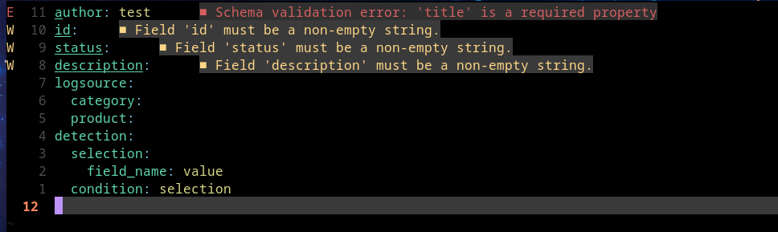

## Sigma Language Server

[Sigma](https://sigmahq.io/docs/guide/getting-started.html)

A small Language server to assist in writing sigma rules.

Sigma rules are yaml files that contain info to detect malicious behavior when suspecting log files in various SIEMs.

I have been writing a lot of these rules lately and I use neovim (btw), so I wanted to make it easy for myself. It may be useful to y'all.

The LS provides features such as diagnostics and completion. I've also created a little plugin for compiling with sigmac from within neovim itself.
No need to leave your beloved editor when writing sigma rules. You can get the conversion plugin [here](https://github.com/pop-ecx/sigma_picker.nvim) 


## How it feels
Real time diagnostics is provided as you write your sigma rules



## Installation instructions
- Git clone the repo
- cd into the repo
- run poetry install
- Connect to the LSP in Neovim by adding this to your init.lua file
```lua
vim.api.nvim_create_autocmd('FileType', {
  pattern = 'yaml',
  callback = function (args)
    vim.lsp.start({
      name = 'Sigma_ls',
      cmd = {"<poetry env info path>/bin/python", "/path/to/repo/main.py"},
    })
  end,
})
```
> Ensure you have poetry in your system

## Extra capability
It is now possible to search for tags by simply typing


```lua
SearchMitre <keyword>
```

To get this capability simply add this to your init.lua:
```lua
vim.api.nvim_create_user_command("SearchMitre", function(opts)
    local keyword = opts.args
    vim.lsp.buf_request(0, "sigma/searchMitre", { keyword = keyword }, function(err, result)
        if err then
            vim.notify("Error: " .. err.message, vim.log.levels.ERROR)
        elseif type(result) ~= "table" then
            vim.notify("Unexpected response format from LSP server.", vim.log.levels.ERROR)
        elseif result.error then
            vim.notify("Error: " .. result.error, vim.log.levels.WARN)
        elseif result.matches then
            if #result.matches > 0 then
                local formatted_results = {}
                for _, match in ipairs(result.matches) do
                    table.insert(formatted_results, match.tag .. ": " .. match.description)
                end
                vim.notify("MITRE ATT&CK Matches:\n" .. table.concat(formatted_results, "\n"), vim.log.levels.INFO)
            else
                vim.notify("No matches found.", vim.log.levels.WARN)
            end
        else
            vim.notify("Unexpected result structure from LSP server.", vim.log.levels.ERROR)
        end
    end)
end, { nargs = 1 })
```
## Install in dev mode
run

```bash
poetry install
```

> :warning: This is still WIP.
