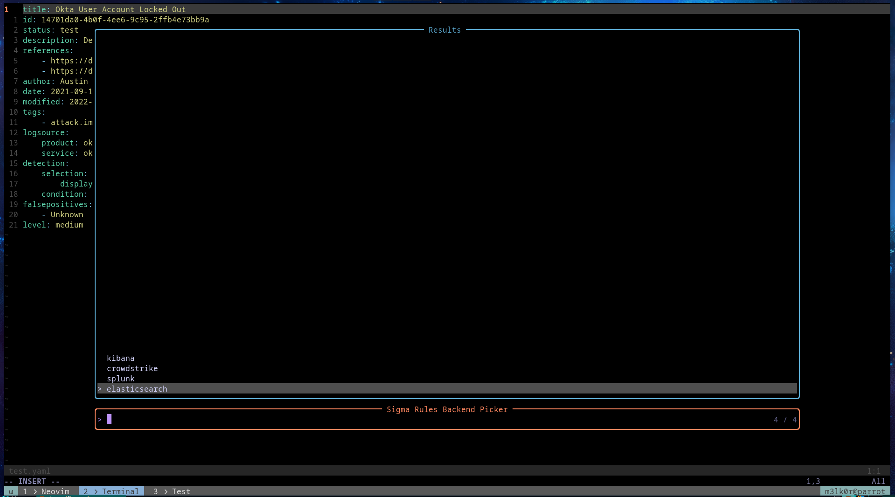
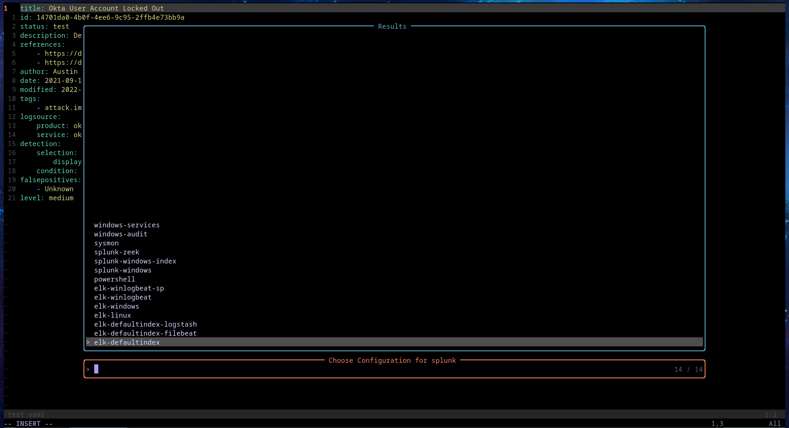
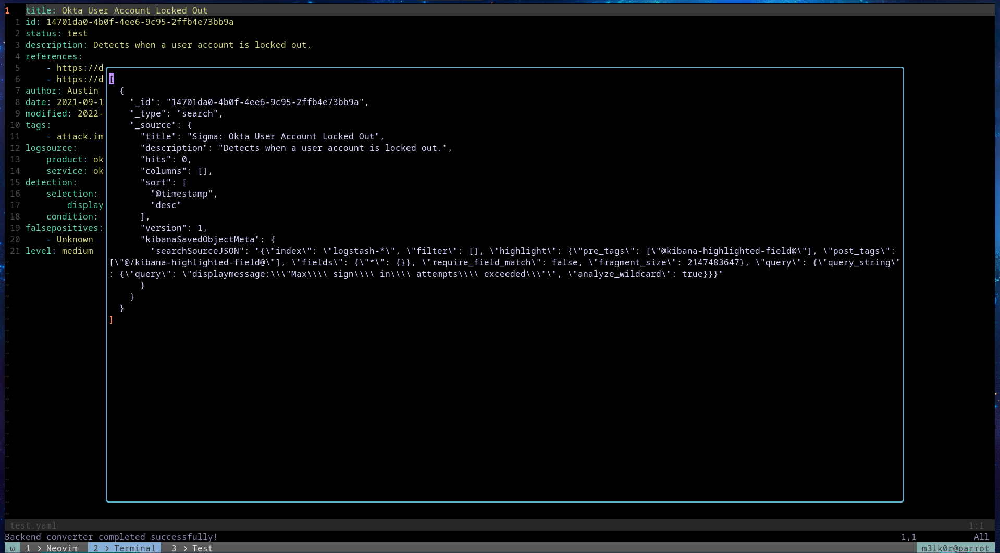

## Sigma LS


A small Language server to assist in writing sigma rules.

Sigma rules are yaml files that contain info to detect malicious behavior when suspecting log files in various SIEMs.

I have been writing a lot of these rules lately and I use neovim (btw), so I wanted to make it easy for myself. It may be useful to y'all.

The LS provides features such as diagnostics and completion. It also has a little extension for compiling with sigmac and get results from within neovim itself.
No need to leave your beloved editor.


## How it feels
Real time diagnostics is provided as you write your sigma rules


Once you are comfortable with your rule, call the backend picker and choose


Now choose the preferred config


Your rule should be compiled and you'll get a result like this:



## Installation instructions
To connect to the LSP in Neovim add this to your init.lua file
```lua
vim.api.nvim_create_autocmd('FileType', {
  pattern = 'yaml',
  callback = function (args)
    vim.lsp.start({
      name = 'Sigma_ls',
      cmd = {"/home/m3lk0r/pygls/bin/python3.11", "/home/m3lk0r/Desktop/sigma-ls/main.py"},
    })
  end,
})
```

> This is still experimental. For now only four backends are supported. 
